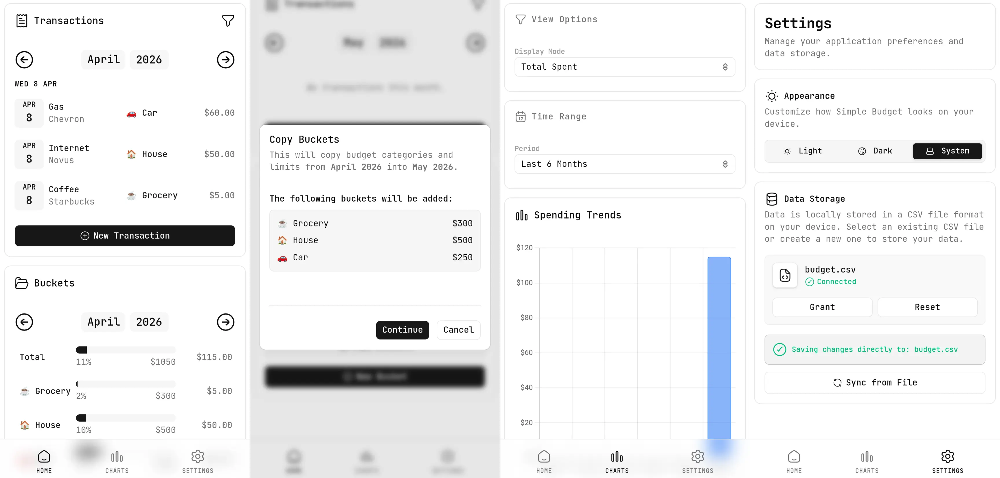
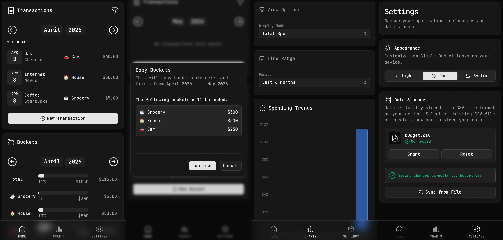

# Simple Budget (v3.0)

A local-first, private, and minimal budgeting application that stores all your data in a single CSV file on your device. No cloud, no database servers, and no trackers.

Check it out here: https://simple-budget.singhramanpreet.com/




## Why Local-First?

- **Data Ownership**: You choose a CSV file on your device. The app reads and writes directly to it using the [File System Access API](https://developer.mozilla.org/en-US/docs/Web/API/File_System_Access_API).
  - _Note: This is a browser API and may not work in all browsers._
- **Privacy by Design**: Your data never leaves your browser. There is no backend, no telemetry, and no accounts.
- **Portability**: Your budget is just a CSV file. You can open it in Excel, Google Sheets, or any text editor at any time.

## Features

- **Direct File Sync**: Native browser integration to save changes directly to your local file.
- **Interactive Dashboard**: Track spending vs. budget limits with real-time progress bars.
- **Smart Categorization**: Group transactions into "Buckets" to monitor your monthly goals.
- **Autocomplete Entry**: Fast data entry with autocomplete for names and notes based on your history.
- **IndexedDB Caching**: Immediate UI updates and persistence across refreshes, even before you re-grant file permissions.
- **Minimalist Aesthetic**: A premium, dark-mode focused UI built with Tailwind CSS and HugeIcons.

## Getting Started

### 1. Launch the App

Visit the hosted version or run it locally (see below).

### 2. Connect Your Data

- Go to the **Settings** page.
- Choose **"Create New"** to initialize a fresh `budget.csv` file on your device.
- Or choose **"Pick CSV"** to connect an existing file.

### 3. Grant Permissions

Because of browser security, you will be prompted to "Grant Access" to your file when you first open the app or after a full page refresh. This ensures only you can modify your data.

## Data Format

Simple Budget uses a flat CSV structure. All transactions and budget limits are stored in the same file:

| date       | name | amount | category  | category_limit | notes        |
| :--------- | :--- | :----- | :-------- | :------------- | :----------- |
| 2026-04-01 | Rent | 1200   | Housing   | 0              | Monthly rent |
| 2026-04-01 |      | 0      | Groceries | 500            |              |

- **Transactions**: Have a `name` and `amount`. `category_limit` is `0`.
- **Budget Limits**: Have an empty `name`, `amount` of `0`, and a `category_limit` > 0. These define your budget for a specific category in a given month.

## Local Development

Simple Budget is built with **React**, **Vite**, and **Tailwind CSS**.

### Prerequisites

- [Bun](https://bun.sh/) (Recommended) or Node.js

### Setup

```bash
# Install dependencies
bun install

# Run development server
bun run dev
```

### Tests

UI tests run on Bun's built-in test runner with [happy-dom](https://github.com/capricorn86/happy-dom) and [Testing Library](https://testing-library.com/). They exercise the real providers against an in-memory CSV file, so no browser is needed.

```bash
# Run the whole suite
bun test

# Only tests affected by uncommitted changes
bun test --changed

# Isolate each file in a fresh global, or spread files across workers
bun test --isolate
bun test --parallel
```

Test files live next to the components they cover (`*.test.tsx`); shared helpers are in [test/](test/).

### Screenshots

The images at the top of this README are generated headlessly by [scripts/screenshots.ts](scripts/screenshots.ts). It builds the app, drives it in Chrome through `Bun.WebView` with a fixed budget, date and locale, captures four phone-sized screens per theme, and stitches them into a WebP with `Bun.Image`.

```bash
# Needs Bun 1.4+ and a Chrome/Chromium binary (auto-detected, or set BUN_CHROME_PATH / pass --chrome)
bun run screenshots
```

## Migration from v2 (SQLite)

If you have a `data.db` from a previous version, use the provided migration script:

```bash
python3 migrate_to_csv.py data.db > budget.csv
```

---

[MIT License](LICENSE)
